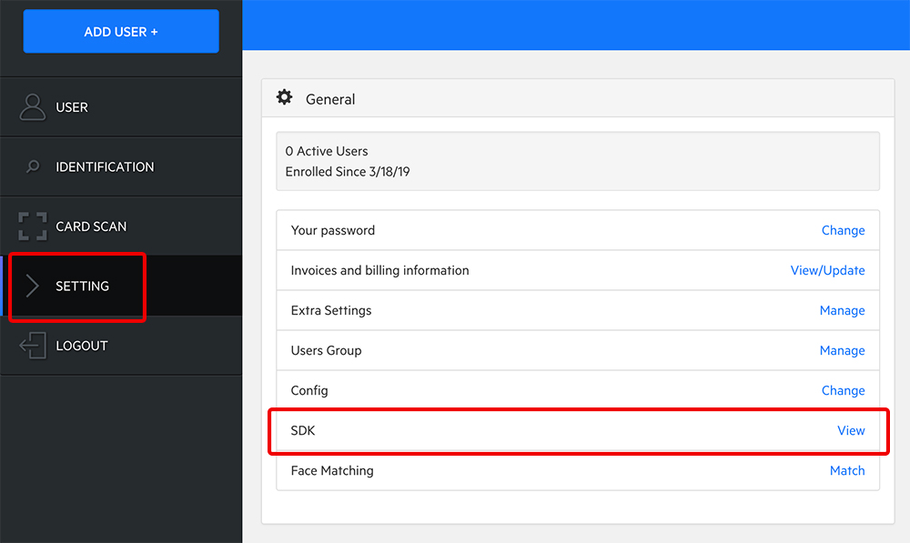
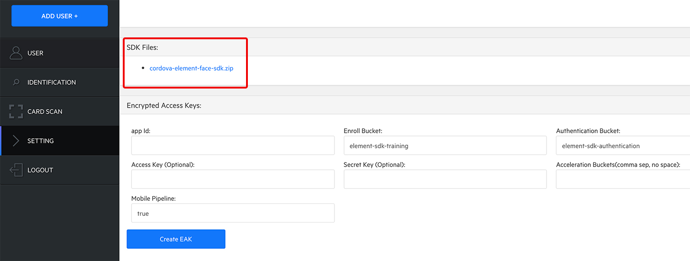
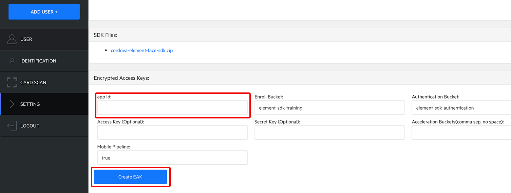
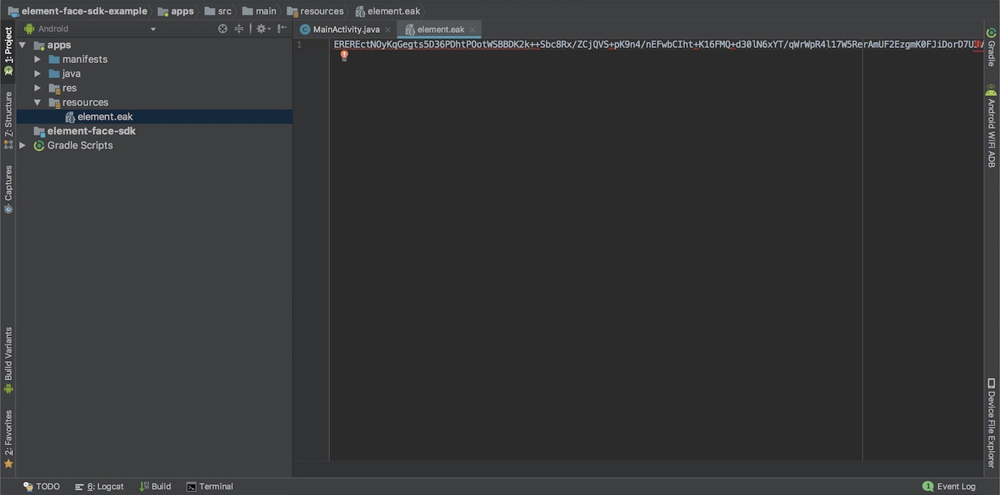

# Cordova Element Face SDK
The Element Face SDK is an API library to create the biometric models that can be used to authenticate users. This document contains information to integrate the Element Face SDK into an Cordova Android application and get the provided example running. Creating a working Cordova App from scratch is not in scope. [Read about that here.](https://cordova.apache.org/docs/en/latest/guide/cli/index.html)

## Version Support
- The Element Face SDK supports Android 5.0+ / API 21+ (Lollipop and up)
- Android Studio 3.1.3 with Gradle 4.4
- Last Target SDK Version: 28

## Prerequisites
### Element Dashboard
The Element Dashboard is the gateway to the assets in order to use the Element Face SDK. The URL of the Element Dashboard varies based on your region. Also an account is required to access the Element Dashboard. Please contact [Element](./README.md#questions) for more information.

### Cordova Face SDK Plugin
The Cordova Element Face SDK has been package as a [Cordova Andriod Plugin](https://cordova.apache.org/docs/en/latest/)
Download the Plugin:
1. Log into the Element Dashboard with your account.
1. Select `Account` tab in the left navigation bar.
1. Find the menu item named `SDK`, click the `View` button next to it.

1. Under `SDK Files` section, click the SDK download link and save it to the desktop of your computer.


## Setup with Cordova
The included example is already configured to work with the included plugin, all that is needed is your EAK. This section describes how the plugin can be added to another Cordova project.

### Import the Plugin
Once you have a basic Cordova project created, the following steps are done from your projects root directory. **This example comes with the plugin pre-installed so you can skip Step 2 if not using your own app code.**
1. Run ```cordova platform add android@8.0.0``` to add Android support to your project which should be at least 8.0.0
2. Run ```cordova plugin add <path to Face SDK Plugin>```. This will create a symbolic link in your project including the Face SDK AAR and a plugin entry in *config.xml*, as well copy over all required plugin files, libraries, and configurations.
```
<plugin name="element-face-sdk" spec="/path/to/element-face-sdk/plugin" />
```
Note: if an older version of the plugin is already installed, please remove it first with ```cordova plugin remove element-face-sdk```

### Register the Application Id (App Id) to Element and obtain the Encrypted Access Key (EAK)
The Element Face SDK requires the *Encrypted Access Key* (*EAK*) file. The *EAK* file carries encrypted information including the [Application Id (App Id)](https://developer.android.com/studio/build/application-id) of your Android app. Your registered *EAK* is available on the Element Dashboard, under `Account -> SDK`. Here is how you get a new *EAK* file:
1. On the same page of where you download the SDK file, fill in the `App Id` field with your `application id`. You can find your `application id` in your module-level `build.gradle` file. Leave other fields unchanged and click `Create EAK`.
1. You new EAK will be listed on the page. Hover your mouse on the EAK you want to download and a little download icon will appear next to your `app id`. Click it, name the file `element.eak` and save it to the desktop of your computer.



### Include the EAK in the application
1. Find the blank EAK file at `[project dir]/app/src/main/resources/element.eak` (added with plugin)
1. Copy your Element EAK into `element.eak`


## Using the Element Face SDK APIs
### Initialize the Element Face SDK
Installing the Face SDK Plugin copies the `ElementCordovaFaceSDK` class into your project. This is the Java interface into the Face SDK. The Plugin also brings in "element.js". This is the Javascript interface used by your app code. All functions are called via the "element" object.

For more information, please refer to the [Plugin Guide](../element-cordova-face-plugin/README.md)

### Ask for user permissions
The Element Face SDK Plugin manages all required permissions. They are CAMERA, ACCESS_FINE_LOCATION, ACCESS_COARSE_LOCATION.

### Questions?
If you have questions, please contact devsupport@discoverelement.com.
